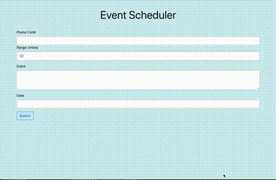

# tdb-project-1: Event & Hotel API search

This Project will query an event & hotel API that will run in the browser and feature dynamically updated HTML and CSS.

It will use the [SeatGeek API](https://api.seatgeek.com/2/events) to retrieve event data in the postal-code area for a given date and description.
It will use the [Best Booking API](https://best-booking-com-hotel.p.rapidapi.com/booking/best-accommodation) from Rapid API to retrieve the recommended hotel in the area. The documentation of each API includes some examples.
It will use `localStorage` to store any persistent data.

## User Story

```
AS A traveler
I WANT to see events in my traveling areas and good hotels nearby
SO THAT I can plan a trip accordingly
```

## Acceptance Criteria

```
GIVEN an event dashboard with form inputs
WHEN I search for events
THEN I am presented with 10 recommended events that match given field inputs of (postal-code, range, event-name, event-date)
WHEN I leave an input field blank
THEN I see results without the blank field filter applied
WHEN I click the find-hotel column next to an event
THEN I am presented with the recommended hotel in the area with the hotel-name, hotel-rating, hotel-price(if available), and hotel-website
WHEN I click the hotel website URL
THEN I redirected to the hotel website so I can book a reservation
WHEN I resize the window
THEN I see the form inputs and results resize to fit the new viewing size
```

## Results

* The URL of the deployed application is listed below:

https://terrybrownpdx.github.io/tdb-project-1/

* Below is a gif showing the completed product:



- - -
© 2020 Terry Brown. All Rights Reserved.
